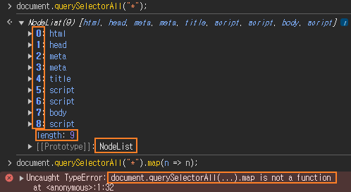
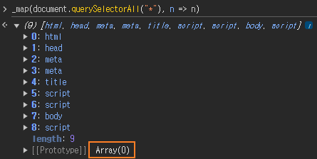
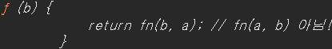
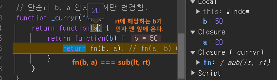

# company_functional
20240913 발표용

## 함수형 프로그래밍이란?
부수 효과(Side Effect)를 미워하고 조합성을 강조하는 프로그래밍 패러다임

### 순수 함수
동일한 인자 값에 동일한 결과를 항상 반환하는 함수
부수 효과가 없는 함수
인자와 반환 값으로만 소통한다
```javascript
function add(a, b) {
    return a + b;
}
```
#### 퀴즈1 
```javascript
const SIDE_EFFECT = 10;

function add(a, b) {
    return a + b + SIDE_EFFECT;
}
```
#### 퀴즈2 https://www.tutorialspoint.com/online_java_compiler.php
```java
import java.util.Random;

public class Main {
	public static void main(String[] args) {
		System.out.println(add(10, 10));
		System.out.println(add(10, 10));
		System.out.println(add(10, 10));
		System.out.println(add(10, 10));
		System.out.println(add(10, 10));
		System.out.println(add(10, 10));
		System.out.println(add(10, 10));
		System.out.println(add(10, 10));
	}
	
	static Integer add(Integer lt, Integer rt) {
		return lt + rt + new Random(0).nextInt(100);
	}
}
```
#### 퀴즈3 
```javascript
const SIDE_EFFECT = Math.random;

function add(a, b) {
    return a + b + SIDE_EFFECT(0);
}
```
#### 순수 함수는 부수 효과를 받는 것 뿐만 아니라 일으켜도 안된다
```javascript
let victim = "무죄";

function add(a, b) {
    victim = "유죄";
    return a + b;
}
```


**주의사항**
사이드 이펙트 뜻은 부작용으로 그 어감만으로는 부정적인 뉘양스가 있으나 증상 자체는 옳고 그름이 없습니다.

#### 사이드 이펙트 없이 새로운 값을 반환
```javascript
function merge(obj1, obj2) {
    // 값만 읽어서 새로운 객체를 리턴
    return {
        obj1 : obj1. val ,
        obj2 : obj2. val ,
    };
}
console.log(merge({val : 10}, {val : 20}));
```
부수 효과가 없기 실행 시점에 대한 의존성이 없어진다. 언제 실행해도 외부에 영향을 받지 않기 때문에 같은 값을 반환하기 때문이다. 이 특성으로 병렬 처리 또한 쉬워진다. 함수 간 조합성도 좋아진다. 함수를 다른 함수의 인자로 사용해도 순수 함수이기 때문에 문제가 되지 않는다.

### 일급함수
함수를 값 처럼 다루는 것.
```javascript
let add = function (a, b) { return a + b; };
```

### 고차함수
함수를 인자로 받는 함수
함수형 프로그래밍은 순수함수를 인자로 받아 더 상위 개념의 고차함수로 만들어 조합성을 강조한다.
```javascript
function add_maker() {
    return (a, b) => a + b;
}
```
### 고차함수 + 클로저
클로저까지 응용하면 평가 시점을 완전히 조정가능하다.
```javascript
function add_maker(a) {
	// add_maker(10) 호출 후 반환된 화살표 함수는 순수 함수인가요?
    return b => a + b; 
}
```
이 모든 구현은 순수 함수이기에 가능한 구현 방식

---
## filter - 거르기 함수
* 인자로 들어온 컬렉션 사이즈보다 반환되는 컬렉션 사이즈가 같거나 작다.

```javascript
function _filter(list, predi) {
	// 반드시 새로운 컬렉션으로 반환한다.
    const result = [];

    for (let i = 0; i < list.length; i++) {
        if (predi(list[i])) {
            result.push(list[i]);
        }
    }

    return result;
}
```
## map - 변환하기 함수
* 인자로 들어온 컬렉션 사이즈와 반환되는 컬렉션 사이즈 같다.

```javascript
function _map(list, mapper) {
    const result = [];

    for (let i = 0; i < list.length; i++) {
        result.push(mapper(list[i]));
    }

    return result;
}
```
## each - 반복 함수
* 인자로 들어온 컬렉션 사이즈만큼, 인자 함수를 실행해주는 함수

```javascript
function _each(list, fn) {
    for (let i = 0; i < list.length; i++) {
        fn(list[i]);
    }
}
```

## 메서드와 함수 차이 및 filter, map, each 구현 의의
* 메서드는 클래스에 종속된 행동
* 함수는 단독으로 존재하는 행동
```javascript
// 차이 고민해보기
const predi = n => n % 2 === 0;
const mapper = n => n * 2;
const identity = n => n;

// Array 메서드
const data = [1, 2, 3, 4, 5, 6, 7, 8, 9, 10];
const arr_filter = data.filter(predi);  // [2, 4, 6, 8, 10]
const arr_map = data.map(mapper);  // [2, 4, 6, 8, 10, 12, 14, 16, 18, 20]
data.forEach(identity);
// 함수 
const fn_filter = _filter(data, predi);
const fn_map = _map(data, mapper);
_each(data, identity);
```
#### 핵심 차이점
데이터(배열)가 먼저오고 뒤에 메서드가 존재한다. (타입에 의존적)
`data.filter(predi);`
데이터 존재 전에 함수가 존재한다.
`_filter(data, predi);`

메서드는 그 클래스가 아니면 해당 메서드를 사용할 수 없다.
하지만 자바스크립트 경우 ArrayLike 같은 객체들이 존재하는데 이 경우 Array API를 사용하지 못한다. 분명 돌림직한 데이터지만 Array가 아니기 때문이다.

`document.querySelectorAll("*").map(n => n);`


우리가 만든 함수는 정상 동작한다.

구현한 함수는 인자로 받은 객체에 length가 존재하며 index:value 쌍으로 데이터가 존재하면 정상동작

바꿔 말하면, 구현한 함수가 Array API 보다 더 추상화 수준이 높아 `다형성`이 높다고 할 수 있습니다.

## each 적용
```javascript
function _filter(list, predi) {
    const result = [];

    _each(list, val => {
        if (predi(val)) {
            result.push(val);
        }
    });

    return result;
}

function _map(list, mapper) {
    const result = [];

    _each(list, val => {
        result.push(mapper(val));
    })

    return result;
}
```
### 테스트 코드
```javascript
// 돌림직한 배열 유사체
var a = _filter(document.all, t => t);
console.log(a);
var b = _map(a, node => node.nodeName);
console.log(b);
```

## 커링
매개변수 입력을 마음대로 조정해서 평가 시점을 제어하는 기법
```javascript
function _curry(fn) {
    return function(a) {
        return function(b) {
            return fn(a, b);
        }
    }
}
```
### 테스트 코드
```javascript
const 빼기_함수 = _curry((lt, rt) => lt - rt);
console.log(빼기_함수(50)(20)); // 30
```
#### 퀴즈 
```javascript
const 빼기_20_함수 = 빼기_함수(20);
console.log(빼기_20_함수(50)); // 실행 결과는?
```
50에 20을 빼니 30 입니다.
<br><br><br><br><br><br>
사실 정답은 -30 입니다. `빼기_함수(20)(50)` 이렇게 호출한 것과 같거든요.

결과적으로 위 코드는 표현력이 좋은 코드는 아닙니다.
`빼기_20_함수(50)` 실행 결과는 50에 20 을 빼는 듯한 느낌을 개발자에게 주기 때문이죠. 
다른 방법이 없을까요?

### 단순 인자 순서 바꾸기 
겸사겸사 커링 동작 과정을 상세히 톺아봅시다.
```javascript
// 단순히 b, a 인자 순서만 변경함.
function _curryr(fn) {
    return function(a) {
        return function(b) {
            return fn(b, a); // fn(a, b) 아님!
        }
    }
}
```
`_curryr` 은 함수 실행 시 인자 순서만 바꾼 함수입니다. `r` 이 붙은 이유는 단순히 원래 인자로 받은 `fn` 순수 함수 실행 시 제일 나중에 들어온 오른쪽 인자부터 먼저 적용한다고 해서 `r` 입니다.
```javascript
// 예시
function sub(lt, rt) {
    return lt - rt;
}
// curryr 적용
const _sub = _curryr(sub);
console.log(_sub);
```

`_curryr` 함수를 실행해서 함수를 반환했습니다.
 ```javascript
const _sub_20 = _sub(20);
console.log(_sub_20);
```

인자로 넣은 `20`은 `a` 자리입니다. 즉, 기존 `sub` 함수의 `lt`가 `a`위치입니다.
```javascript
console.log(
    _sub_20(50) // 여기에 브레이크 포인트 걸기
);
```
