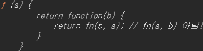

# 선수 지식
* 20240913 발표용

## 함수형 프로그래밍이란?

부수 효과(Side Effect)를 미워하고 조합성을 강조하는 프로그래밍 패러다임  

## 순수 함수

* 동일한 인자 값에 동일한 결과를 항상 반환하는 함수  
* 부수 효과가 없는 함수  
* 인자와 반환 값으로만 소통한다  

```javascript
function add(a, b) {
    return a + b;
}

console.log(add(123, 456));
```

### 퀴즈1 - 순수 함수?

```javascript
const SIDE_EFFECT = 10; // 상수!!

function add(a, b) {
    return a + b + SIDE_EFFECT;
}
```

<details>

* 아무리 상수여도 외부 상태에 의존해 순수 함수가 아닙니다.
* 함수의 결과는 오직 입력값에만 의존해야 합니다.
* 상수는 런타임에는 영속적이지만 컴파일 타임에는 누군가 바꿀 수 있습니다. 상수가 변경되어 재배포 시 이 함수는 흔들리기 때문에 순수 함수가 아닙니다.

</details>


### 퀴즈2 - 순수 함수?

https://www.tutorialspoint.com/online_java_compiler.php  

```java
import java.util.Random;

public class Main {
	public static void main(String[] args) {
		System.out.println(add(10, 10));
		System.out.println(add(10, 10));
		System.out.println(add(10, 10));
		System.out.println(add(10, 10));
		System.out.println(add(10, 10));
		System.out.println(add(10, 10));
		System.out.println(add(10, 10));
		System.out.println(add(10, 10));
	}
	
	static Integer add(Integer lt, Integer rt) {
		return lt + rt + new Random(0).nextInt(100);
	}
}
```

<details>

* 아무리 상수여도 외부 상태에 의존해 순수 함수가 아닙니다.
* 함수의 결과는 오직 입력값에만 의존해야 합니다.
* 시드 값이 동일하면 같은 랜덤 값이 나온다해도 Random 클래스에 의존히고 있습니다. 향후 구현이 변경되면 이 함수도 영향을 받기 때문에 순수 함수가 아닙니다.

</details>

### 퀴즈3 - 같은 값이 나올까요?

```javascript
const SIDE_EFFECT = Math.random;

function add(a, b) {
    return a + b + SIDE_EFFECT(0);
}
```

### 순수 함수는 부수 효과를 받는 것 뿐만 아니라 일으켜도 안된다

```javascript
let victim = "무죄";
console.log(victim);
function add(a, b) {
    victim = "유죄";
    return a + b;
}
console.log(victim);
```

### 사이드 이펙트 없이 새로운 값을 반환

* 인자로 들어온 원본 값을 훼손하지 않으면서 항상 새로운 값을 반환  

```javascript
var lt = {lt : 10};
var rt = {rt : 20}
console.log(lt, rt);
function merge(lt, rt) {
    // 값만 읽어서 새로운 객체를 리턴
    return {
        lt : lt. lt ,
        rt : rt. rt ,
    };
}
lt["lt"] = 123;
rt["rt"] = 456;
console.log(merge(lt, rt));
```

**참고 사항**  

* 사이드 이펙트 뜻은 부작용으로 그 어감만으로는 부정적인 어감이 있으나 증상 자체는 옳고 그름이 없습니다.  

### 순수 함수에 이점

* 부수 효과가 없기 때문에 내가 실행 시점을 조정할 수 있다.(커링)  
* 부수 효과가 없기 때문에 함수 간 조합성이 좋아진다.(고차 함수)  
* 부수 효과 없기 때문에 병렬 처리가 쉬워진다.  

## 일급함수

함수를 값 처럼 다루는 것.  

```javascript
var add = function (a, b) { 
        return a + b; 
};
```

## 고차함수

* 함수를 인자로 받는 함수  
* 함수를 반환 하기도 하는 함수  
* 함수형 프로그래밍은 순수함수를 인자로 받아 더 상위 개념의 고차함수로 만들어 조합성을 강조한다.  

```javascript
function add_maker() {
    return (a, b) => a + b;
}
function execute_add(add) {
    return add(500, 100);
}
console.log(execute_add(add_maker()));
```

## 고차함수 + 클로저

* 클로저까지 응용하면 평가 시점을 완전히 조정가능하다.  

```javascript
function add_maker(a) {
    return b => a + b; 
}
console.log(add_maker(500)(200));
```

이 모든 구현은 순수 함수이기에 가능한 구현 방식  

---
# 구현 시작
--- 

## filter - 거르기 함수

* 인자로 들어온 컬렉션 사이즈보다 반환되는 컬렉션 사이즈가 같거나 작다.  

```javascript
function _filter(list, predi) {
	// 반드시 새로운 컬렉션으로 반환한다.
    const result = [];

    for (let i = 0; i < list.length; i++) {
        if (predi(list[i])) {
            result.push(list[i]);
        }
    }

    return result;
}

console.log(
    _filter(users, u => u.age > 30)
);
```

## map - 변환하기 함수

* 인자로 들어온 컬렉션 사이즈와 반환되는 컬렉션 사이즈 같다.  

```javascript
function _map(list, mapper) {
    const result = [];

    for (let i = 0; i < list.length; i++) {
        result.push(mapper(list[i]));
    }

    return result;
}

console.log(
    _map(users, u => u.name)
);
```

## each - 반복 함수

* 인자로 들어온 컬렉션 사이즈만큼, 인자 함수를 실행해주는 함수  

```javascript
function _each(list, fn) {
    for (let i = 0; i < list.length; i++) {
        fn(list[i]);
    }
}

_each([1, 2, 3], n => console.log(n));
```

## 메서드와 함수 차이 및 filter, map, each 구현 의의

* 메서드는 클래스에 종속된 행동  
* 함수는 단독으로 존재하는 행동  

```javascript
// 차이 고민해보기
const predi = n => n % 2 === 0;
const mapper = n => n * 2;
const print = v => console.log(v);

// Array 메서드
const data = [1, 2, 3, 4, 5, 6];
data.filter(predi).map(mapper).forEach(print);
console.log("==========");
// 함수 
_each(_map(_filter(data, predi), mapper), print);
```

Array API를 사용하면 되는데 왜 함수인가?

### 핵심 차이점  

데이터(배열)가 먼저오고 뒤에 메서드가 존재한다. (타입에 의존적)  
`data.filter(predi);`  
데이터 존재 전에 함수가 존재한다.  
`_filter(data, predi);`  

메서드는 그 클래스가 아니면 해당 메서드를 사용할 수 없다. 하지만 자바스크립트 경우 ArrayLike 같은 객체들이 존재하는데 이 경우 Array API를 사용하지 못한다. 분명 돌림직한 데이터지만 Array가 아니기 때문이다.

```javascript
document.querySelectorAll("*").map(n => n); // 실패
```

  <br>

우리가 만든 함수는 정상 동작한다.  <br>

```javascript
console.log(_map(document.querySelectorAll("*"), n => n));
```

  <br>

구현한 함수는 인자로 받은 객체에 length가 존재하며 index:value 쌍으로 데이터가 존재하면 정상동작합니다.
구현한 함수가 Array API 보다 더 추상화 수준이 높아 `다형성`이 높습니다.

## each 적용

```javascript
function _filter(list, predi) {
    const result = [];

    _each(list, val => {
        if (predi(val)) {
            result.push(val);
        }
    });

    return result;
}

function _map(list, mapper) {
    const result = [];

    _each(list, val => {
        result.push(mapper(val));
    })

    return result;
}
```

### 테스트 코드

```javascript
// 돌림직한 배열 유사체
var a = _filter(document.all, t => t);
console.log(a);
var b = _map(a, node => node.nodeName);
console.log(b);
```

## 커링

* 매개변수 입력을 마음대로 조정해서 평가 시점을 제어하는 기법  

```javascript
function _curry(fn) {
    return function(a) {
        return function(b) {
            return fn(a, b);
        }
    }
}
// 화살표 함수 사용 시 표현력
function _curry(fn) {
    return a => b => fn(a, b);
}
```

### 테스트 코드

```javascript
const 빼기_함수 = _curry((lt, rt) => lt - rt);
console.log(빼기_함수(50)(20)); // 30
```

### 퀴즈 

```javascript
const 빼기_20_함수 = 빼기_함수(20);
console.log(빼기_20_함수(50)); // 실행 결과는?
```

50에 20을 빼니 30 입니다.  

<details>

사실 정답은 -30 입니다. `빼기_함수(20)(50)` 이렇게 호출한 것과 같거든요.  
위 코드는 표현력이 좋은 코드는 아닙니다.  
`빼기_20_함수(50)` 실행 결과는 50에 20 을 빼는 듯한 느낌을 개발자에게 주기 때문이죠. 
다른 방법이 없을까요?

</details>


### 단순 인자 순서 바꾸기 

```javascript
// 단순히 b, a 인자 순서만 변경함.
function _curryr(fn) {
    return function(a) {
        return function(b) {
            return fn(b, a); // fn(a, b) 아님!
        }
    }
}
```

`_curryr` 은 함수 실행 시 인자 순서만 바꾼 함수입니다. `r` 이 붙은 이유는 단순히 원래 인자로 받은 `fn` 순수 함수 실행 시 제일 나중에 들어온 오른쪽 인자부터 먼저 적용한다고 해서 `r` 입니다.

* 기존 `빼기_함수` 에 `_curry`을 `_curryr` 바꾼 후 재실행 해보기  

#### 과정 톺아보기

```javascript
function sub(lt, rt) {
    return lt - rt;
}

const _sub = _curryr(sub);
console.log(_sub); // 커링 적용된 sub
```

  <br>

`_curryr` 함수를 실행해서 함수를 반환했습니다.  

```javascript
const _sub_20 = _sub(20);
console.log(_sub_20);
```

  <br>

인자로 넣은 `20`은 `a` 자리입니다. 즉, 기존 `sub` 함수의 `lt`가 `a`위치입니다.  

```javascript
console.log(
    _sub_20(50) // 여기에 브레이크 포인트 걸기
);
```

  <br>

### 개선하기

* 커링이 적용된 함수를 지금은 순차적으로 실행하지만 `fn(a, b)` 이렇게 한 번에 호출하는 기능 추가  
* 화살표 함수를 적용해서 간결하게 만들어 표현력 높이기  

```javascript
function _curry(fn) {
    return (a, b) => arguments.length === 2 ? fn(a, b) : b => fn(a, b);
}
function _curryr(fn) {
    return (a, b) => arguments.length === 2 ? fn(a, b) : b => fn(b, a);
}
```

### 퀴즈 - 값 맞추기

```javascript
console.log(
    _curry(sub)(50, 20),
    _curryr(sub)(50, 20),
    _curry(sub)(50)(20),
    _curryr(sub)(50)(20)
);
```

<details>

왜? 동작은 제대로 안 할까요?

### 수정

```javascript
function _curry(fn) {
    return function (a, b) {
        return arguments.length === 2 ? fn(a, b) : b => fn(a, b);
    }
}
function _curryr(fn) {
    return function (a, b) {
        return arguments.length === 2 ? fn(a, b) : b => fn(b, a);
    }
}
```

* 이유는 화살표 함수는 argments 객체를 지원하지 않기 때문입니다.  

</details>

## get - 꺼내기 함수

* 안전하게 값 가져오기

```javascript
function _get(obj, key) {
    // === 아닌 이유는 obj 가 undefined 경우 유연하게 처리하기 위함
    return obj == null ? undefined : obj[key];
}

// 테스트
console.log(_get(users[20], "name"));
try {
    console.log(users[20].name);
} catch (error) {
    // 원래라면 여기서 시스템이 중지
    console.log(error);    
}
// 사용
console.log(
    _map(users, user => user.name),
    _map(users, user => _get(user, "name"))
);

// 커링 적용 후 먼저 인자를 전달해 실행 시점을 조정하면 더 간결
var getName = _curryr(_get)("name");

console.log(
    _map(users, getName)
);
```

## 코드 정리 및 커링 적용

함수를 별도 파일로 추출  <br>
  <br>

커링 적용  

```javascript
const _ = (() => {
    return {
        filter : _curryr(_filter),
        map : _curryr(_map),
        each : _each,
        get : _curryr(_get),
    };
})();
```

## reduce - 축약하기 함수

* 인자로 들어온 컬렉션은 하나의 데이터가 된다.

```javascript
function reduce(list, iter, memo) {
    _.each(list, val => {
        memo = iter(memo, val);
    });

    return memo;
}
console.log(
    reduce([1, 2, 3, 4, 5], (a, b) => a + b, 0)
);
```

### 개선  

* memo 인자가 없는 경우 처리  
* 컬렉션 요소가 1 개 이하인 경우 처리  

```javascript
function _reduce(list, iter, memo) {
    if (arguments.length === 2) {
        memo = list[0];
        list = Array.prototype.slice.call(list, 1);
    }
    _.each(list, val => {
        memo = iter(memo, val);
    });

    return memo;
}
console.log(
    _reduce([1, 2, 3, 4, 5], (a, b) => a + b)
);
console.log(
    _reduce([1], (a, b) => a + b)
);
console.log(
    _reduce([], (a, b) => a + b)
);
```

## pipe, go - 파이프 함수  

* 함수만 인자로 받고, 함수를 리턴하는 reduce 일반화 함수
* 파이프 의미 `함수(입력 => 출력) => 함수(입력 => 출력) ...`  
* 콜백 지옥을 체인 패턴 수준 표현력으로 동일한 기능 수행

```javascript
function _pipe() {
    const fns = arguments;
    return function(val) {
        return _.reduce(fns, function(val, fn) {
            return fn(val);
        }, val);
    }
}
```

### 디버깅 해보기

```javascript
_pipe(
    _.filter(user => user.age > 25),
    _.map(user => user.name),
    console.log
)(users);
```

`go`는 pipe 함수의 즉시 실행 버전  

```javascript
function _go(val) {
    const fns = Array.prototype.slice.call(arguments, 1);
    return pipe.apply(null, fns)(val);
}
```

### 테스트 코드

```javascript
_go(
    users,
    _.filter(user => user.age > 25),
    _.map(user => user.name),
    console.log
)
```

### 퀴즈 - `pipe.apply(null, fns)(val)` 표현력 개선하기

<details>

```javascript
function _go(val) {
    const fns = Array.prototype.slice.call(arguments, 1);
    return _pipe(...fns)(val);
}
```

</details>

## 생각보다 강력한 reduce 맛보기 - group by 구현

```javascript
var ageObj = _.reduce(users, (obj, user) => {
    const key = user.age - user.age % 10;
    
    (obj[key] = obj[key] || []).push(user);

    return obj;
} ,{});

console.log(ageObj);
```

### 변경이 발생하는 구분 추상화하기

```javascript
function groupBy(users, keyFn) {
    return _.reduce(users, function(gp, user) {
        const gpKey = keyFn(user);
        (gp[gpKey] = gp[gpKey] || []).push(user);
        
        return gp;
    }, {});
}

console.log(groupBy(users, user => user.age - user.age % 10));
```

### 더욱 더 작은 함수로 쪼개기 - push 구현

```javascript
function push(obj, key, val) {
    (obj[key] = obj[key] || []).push(val);
    return obj;
}

function groupBy(users, keyFn) {
    return _.reduce(users, (gp, user) => push(gp, keyFn(user), user), {});
}

console.log(groupBy(users, user => user.age - user.age % 10));
```

* 이렇게 작은 함수를 구현하고 함수를 조합하면 변수 선언이 줄어들어 함수가 간결해지고 이는 좋은 표현력으로 나타납니다.  

## each 다형성 높이기

* `each`함수에 `null` 들어오면 에러가 발생하는 부분 개선

```javascript
const _length = _.get("length");

function _each(list, fn) {
    for (let i = 0; i < _length(list); i++) {
        fn(list[i]);
    }
}

_each(null, t => t);
```

* `each` 함수가 돌림직한 데이터를 더 순회할 수 있게 다형성 높이기

```javascript
function _is_object(obj) {
    return typeof obj == 'object' && !!obj;
}

function _keys(obj) {
    return _is_object(obj) ? Object.keys(obj) : [];
}

function _each(list, fn) {
    const keys = _keys(list);
    
    for (let i = 0; i < keys.length; i++) {
        fn(list[keys[i]], keys[i]);
    }
}
```

* 배열의 경우 배열 인덱스에 대한 인덱스가 생겨 정상동작  
* 객체의 경우 키에 대한 인덱스가 생겨 정상동작  
* 추가로 입력 받은 보조함수 뒤에 키를 다룰 수 있도록 인자 추가를 했지만 javascript 동작은 유연해 기존 코드에서 예외를 발생시키지 않음  
* `_each` 조합해서 사용하는 모든 함수가 혜택을 받음

## 마무리

* 함수형 프로그래밍에서는 예외를 발생시키지 않고 그럴싸한 값을 리턴하면서 프로그래밍이 멈추지 않도록 만듭니다.  
* 데이터 형을 강하게 확인하지 않고 다형성을 극대화해 프로그래밍합니다.  
* 함수 구조상 앞에 데이터와 뒤에 보조 함수가 위치하게 되는데 이는 개발자가 앞에 데이터 형을 명확히 알기 때문에 앞에 데이터 형에 구애 받아 강타입으로 체크할 필요가 없습니다.  

## 하지 못한 말 - 지연 연산

평가 시점을 조절한다는 것은 생각보다 강력합니다. 특히 최적화 기회를 얻을 수 있다는 점이 가장 큰 강점입니다. 허나 이를 구현하는 것은 ... 대신 자바를 통한 예제를 준비했습니다.  

https://www.tutorialspoint.com/online_java_compiler.php  

```java
import java.util.ArrayList;
import java.util.List;
import java.util.concurrent.atomic.AtomicInteger;
import java.util.stream.IntStream;

public class Main {

	public static void main(String[] args) {
		// 1 ~ 100 까지 배열
		List<Integer> numList = IntStream.rangeClosed(1, 100).boxed().toList();

		// * 함수형 예시
		AtomicInteger count = new AtomicInteger(0);
		numList.stream() // 이 호출은 함수형 프로그래밍한다라고 생각해주세요.
				.filter(num -> {
					count.incrementAndGet();
					return num % 2 == 0;
				}).limit(1).toList();

		System.out.println("count : " + count);

		// * 일반적인 반복문 예시
		int count2 = 0;
		// filter
		List<Integer> result = new ArrayList<>();
		for (Integer num : numList) {
			count2++;
			if (num % 2 == 0) {
				result.add(num);
			}
		}
		// limit
		List<Integer> result2 = new ArrayList<>();
		for (Integer num : result) {
			if (result2.size() == 1) {
				break;
			}
			count2++;
			result2.add(num);
		}

		System.out.println("count2 : " + count2);

	}
}
```

